# ECE 661 Computer Vision Course
This repository is created for the ECE 661 Computer Vision course.
These comprise of the homeworks that was done as part of the course.
All the codes are in python. And the reports are in LaTeX.

Below are some short descriptions of the homework with some sample images.

---
---

### Short Descriptions of Homeworks:

#### Homework 1:
Review of basic Homogeneous coordinates.

[hw1_problem_statement](homework1/PROBLEM_STATEMENT)

[hw1_report](homework1/REPORT)

---

#### Homework 2:
Estimate Homographies between images and use them to transform images and map images from one domain to a different domain.

[hw2_problem_statement](homework2/PROBLEM_STATEMENT)

[hw2_report](homework2/REPORT)

**Sample Input:**

   

**Sample Output:**

---

#### Homework 3:
Eliminate the Affine and Projective distortions from images using point-to-point correspondence and Vanishing Line method.

[hw3_problem_statement](homework3/PROBLEM_STATEMENT)

[hw3_report](homework3/REPORT)

**Sample Input:**

**Sample Output:**

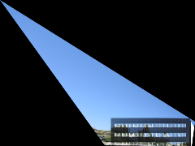

---

#### Homework 4:
Find the SIFT or SURF or Harris Corners interest points from two images of the same scene taken from two different viewpoints, and establish the correspondence between the interest points.

[hw4_problem_statement](homework4/PROBLEM_STATEMENT)

[hw4_report](homework4/REPORT)

**Sample Input:**

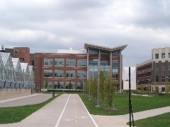   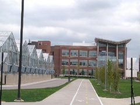

**Sample Output:**

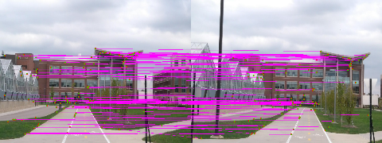

---

#### Homework 5:
Create an initial estimate of homography using Linear Least Squares Minimization and RANSAC algorithm. Then use this initial estimate to calculate Homography automatically by a Non-linear Least Squares method like Levenberg-Marquardt method. And finally use this to stitch a group of images together.

[hw5_problem_statement](homework5/PROBLEM_STATEMENT)

[hw5_report](homework5/REPORT)

**Sample Input:**

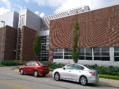   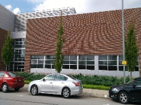   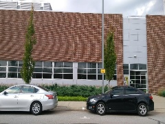   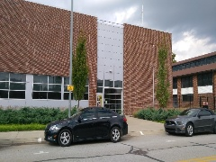   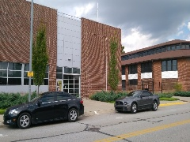

**Sample Output:**

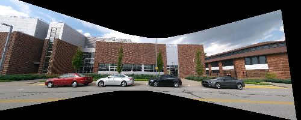

---

#### Homework 6:
Implement Otsu's Algorithm and use RGB and Texture-based Segmention to separate out foreground objects from background of the given images. Also, extract the contours of the segmented foreground.

[hw6_problem_statement](homework6/PROBLEM_STATEMENT)

[hw6_report](homework6/REPORT)

**Sample Input:**

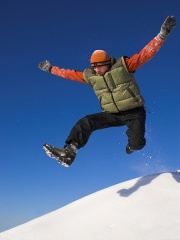

**Sample Output:**

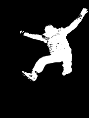   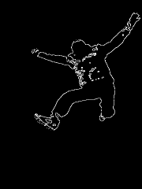

---

#### Homework 7:
Implement a classification algorithm using Local Binary Pattern features and K-Nearest Neighbor Classifier on 5 classes of images {Beach, Building, Car, Mountain, Tree}.

[hw7_problem_statement](homework7/PROBLEM_STATEMENT)

[hw7_report](homework7/REPORT)

**Sample Input:**

         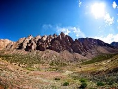   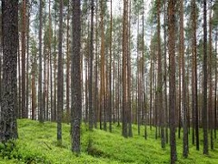

**Sample Output:**

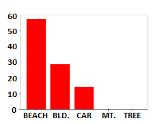   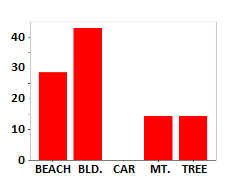   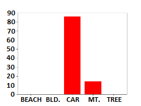   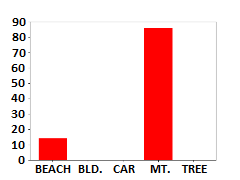   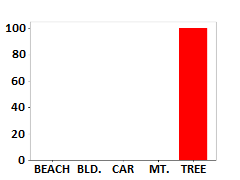

---

#### Homework 8:

Implement Zhang's Algorithm to find the Intrinsic and Extrinsic camera calibration parameters using checker-board patterns. Extract corners from the checker-board patterns, use them as to estimate the parameters and then map world points onto the pattern using those parameters.

[hw8_problem_statement](homework8/PROBLEM_STATEMENT)

