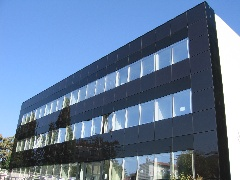

# ECE-661-Computer-Vision-Course
This repository is created for the ECE 661 Computer Vision course.
These comprise of the homeworks that was done as part of the course.
All the codes are in python. And the reports are in LaTeX.

---
---

### Short Descriptions of Homeworks:

#### Homework 1:
Review of basic Homogeneous coordinates.

#### Homework 2:
Estimate Homographies between images and use them to transform images and map images from one domain to a different domain.

**Input:**

   

**Output:**

---

#### Homework 3:
Eliminate the Affine and Projective distortions from images using point-to-point correspondence and Vanishing Line method.

**Output:**

---

#### Homework 4:
Find the SIFT or SURF or Harris Corners interest points from two images of the same scene taken from two different viewpoints, and establish the correspondence between the interest points.

#### Homework 5:
Create an initial estimate of homography using Linear Least Squares Minimization and RANSAC algorithm. Then use this initial estimate to calculate Homography automatically by a Non-linear Least Squares method like Levenberg-Marquardt method. And finally use this to stitch a group of images together.

#### Homework 6:
Segment given images to separate out foreground objects from background of the image. Also, extract the contours of the segmented foreground.
